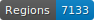
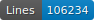
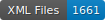
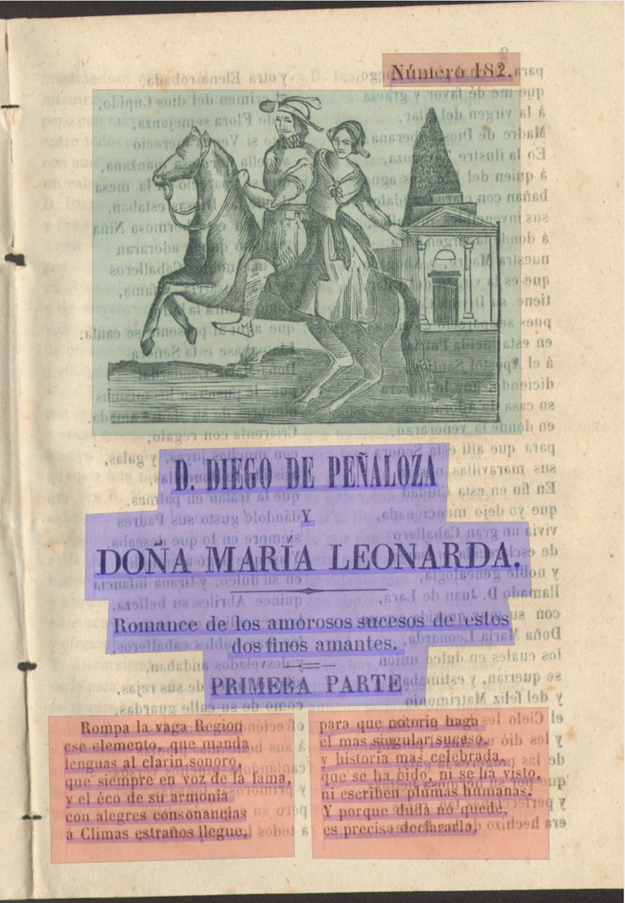
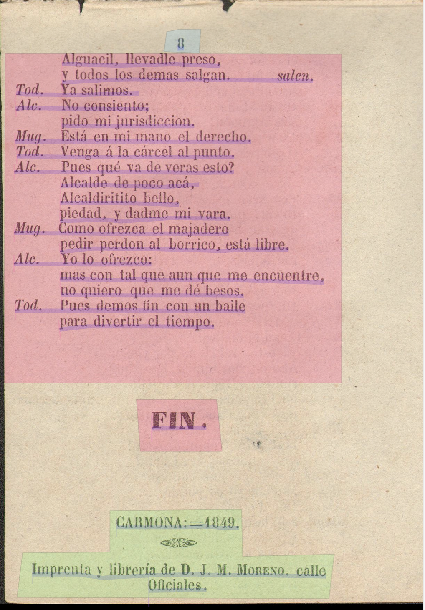

# OCR for the _Varios_ corpus #

This folder contains the documents we used to create our training models, as well as the training models themselves. The directory is divided into two sub-directories : first, the groundtruths, second, the models developed.
******
## [Groundtruths](https://github.com/DesenrollandoElCordel/FoNDUE-Spanish-chapbooks-Dataset/tree/main/Grountruth) ##
   

The ground truth of the _Varios_ corpus was composed with [the ground truth of the _Moreno_ corpus](https://github.com/DesenrollandoElCordel/Moreno-OCR-files/tree/main/Moreno-GroundTruth) to which we added 5 _pliegos_ from the _Varios_ corpus (32 pages), in order to train our model on data in Catalan and with long s. Therefore, the entire GroundTruth data was OCRed once with ABBYY FineReader and then manually corrected. Finally, all the data was exported in PAGE-XML from [Transkribus](https://readcoop.eu/transkribus/?sc=Transkribus) for migration to [eScriptorium](https://gitlab.inria.fr/scripta/escriptorium). 

From eScriptorium, the entire Grountruth has been segmented according to the [_SegmOnto_](https://github.com/SegmOnto/Guidelines) vocabulary, and some baselines have been manually corrected. 

### PAGE ot Alto ###

To make our data interoperable, we decided to follow the pipeline developed by the [_SegmOnto_ project](https://hal.archives-ouvertes.fr/hal-03336528) (segmentation controlled vocabulary, TEI schema, quality control schema). As this project is currently  principally focusing on ALTO XML documents, we decided to convert our data into this format from the e-scriptorium platform. 
We have kept both formats in our repository.

### Corpus segmentation ####

The _SegmOnto_ zones used are : 

- [`MainZone`](https://github.com/SegmOnto/Guidelines/blob/main/zones/MainZone/MainZone.md), in pink.
- [`MainZone:columns`](https://github.com/SegmOnto/Guidelines/blob/main/zones/MainZone/MainZone.md), in orange.
- [`RunningTitleZone`](https://github.com/SegmOnto/Guidelines/blob/main/zones/RunningTitleZone/RunningTitleZone.md).
- [`GraphicZone:illustration`](https://github.com/SegmOnto/Guidelines/blob/main/zones/GraphicZone/DecorationZone.md), in dark green.
- [`GraphicZone:ornamentation`](https://github.com/SegmOnto/Guidelines/blob/main/zones/GraphicZone/DecorationZone.md), in dark blue. 
- [`MusicZone`](https://github.com/SegmOnto/Guidelines/blob/main/zones/MusicZone/MusicZone.md) (some of our chapbooks contain sheet music). 
- [`QuireMarksZone:signature`](https://github.com/SegmOnto/Guidelines/blob/main/zones/QuireMarksZone/QuireMarksZone.md).
- [`QuireMarksZone:catchwords`](https://github.com/SegmOnto/Guidelines/blob/main/zones/QuireMarksZone/QuireMarksZone.md).
- [`NumberingZone:page`](https://github.com/SegmOnto/Guidelines/blob/main/zones/NumberingZone/NumberingZone.md).
- [`MarginTextZone:colophon`](https://github.com/SegmOnto/Guidelines/blob/main/zones/MarginTextZone/MarginTextZone.md) in light green, this zone isolates the name of the printer, the place and date of printing.
- [`MarginTextZone:note`](https://github.com/SegmOnto/Guidelines/blob/main/zones/MarginTextZone/MarginTextZone.md).

To match with the specificities of our corpus, we have used [`CustomZone`](https://github.com/SegmOnto/Guidelines/blob/main/zones/CustomZone/CustomZone.md) with our own subtypes, corresponding to our choices of XML-TEI encoding scheme: 

- `CustomZone:title`, in purple. 
- `CustomZone:impresorNum`, in brown, for printer's numbers.
- `CustomZone:numer_pliego`, when there is mention of the number of _pliegos_ assembled.
 
For the lines we use : 
-  [`CustomLine`](https://github.com/SegmOnto/Guidelines/blob/main/lines/CustomLine/CustomLine.md) with the subtype `:trailer` to indicate _explicit_. 
-  [`HeadingLine`](https://github.com/SegmOnto/Guidelines/blob/main/lines/HeadingLine/HeadingLine.md). 
-  [`DefaultLine`](https://github.com/SegmOnto/Guidelines/blob/main/lines/DefaultLine/DefaultLine.md).

    
  
  

 

### [Split](https://github.com/DesenrollandoElCordel/FoNDUE-Spanish-chapbooks-Dataset/tree/main/Grountruth/Split) ####

We chose to manually divide our Groundtruth into three sets (80% train, 10% eval and 10% test) in order to ensure that the title pages (where the error rate is often higher due to typography) and the new elements of the _Varios_ corpus are distributed equally. Each set was made up of about 20% of title pages and chapbooks belonging to the _Varios_ corpus. Predefining these three sets also ensures that the results of our different models can be compared.

### [Groundtruth test](https://github.com/DesenrollandoElCordel/FoNDUE-Spanish-chapbooks-Dataset/tree/main/Varios-GroundTruth-TEST) ####

A series of tests was done to evaluate the interest of image processing (binarisation, deblurring, luminosity) for character recognition. 
One can find more information here : [__Readme__ Groundtruth test](https://github.com/DesenrollandoElCordel/Varios-OCR-files/blob/main/Grountruths/Varios-GroundTruth-Test-Alto/README.md). 

The results obtained imply that post-processing with Niblack binarisation gives the best results on the OCRisation of our corpus ( **96.80** %). Regarding segmentation, the Niblack binarisation does not bring better results. 
_____________
_____________

## [Models](https://github.com/DesenrollandoElCordel/FoNDUE-Spanish-chapbooks-Dataset/tree/main/Models) ###

### Corpus Out of domain ####

In order to improve our results, we undertook a fine-tuning of our model. The corpus used was constituted from the data of the [HTRCatalogs](https://github.com/Juliettejns/cataloguesSegmentationOCR/) established by Juliette Janes, Simon Gabay and Béatrice Joyeux-Prunel, whose segmentation was corrected to correspond to the latest standards of _SegmOnto_. 

### Modification of the architecture ####

### Results ####

:arrows_clockwise: In progress !
